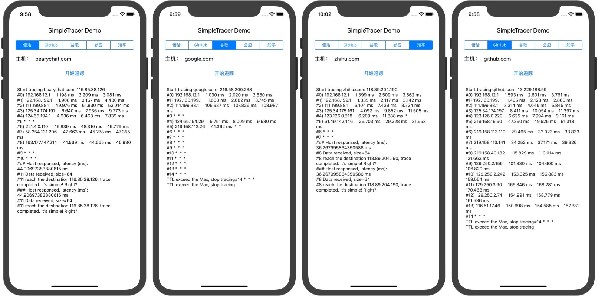

# SimpleTracer

Simple trace route with simple ping, almost simply in Swift.

基于 ping 并采用 Swift 构建的简单 `traceroute`，用于检测客户端与服务主机之间的网络状况。


## Usage 用法

```swift
SimpleTracer.trace(host: testCase.host, 
                   maxTraceTTL: 15) { result in
    print(result)
    /**
     Start tracing www.bearychat.com: 54.223.220.218
     #0) 172.25.23.253     5.610 ms    7.405 ms    7.604 ms
     #1) 111.202.166.1     5.999 ms    6.257 ms    6.459 ms
     #2) 202.106.227.105     8.585 ms    8.883 ms    9.079 ms
     #3) 219.232.11.65     6.965 ms  *  *
     #4) 202.96.13.230     12.778 ms    13.112 ms    13.334 ms
     #5) 124.65.226.134     7.564 ms    7.923 ms    8.219 ms
     #6 *  *  *
     #7 *  *  *
     #8) 54.222.25.140     26.394 ms    26.759 ms    26.997 ms
     #9) 54.222.24.176     10.353 ms    10.939 ms    11.384 ms
     #10) 54.222.25.33     8.901 ms    9.516 ms    9.934 ms
     #11 *  *  *
     #12 *  *  *
     #13 *  *  *
     ### Host responsed, latency (ms): 7.927060127258301 ms
     #14 Data received, size=64
     #14 reach the destination 54.223.220.218, trace completed. It's simple! Right?
     ***/
}
```

## Test cases 示例




